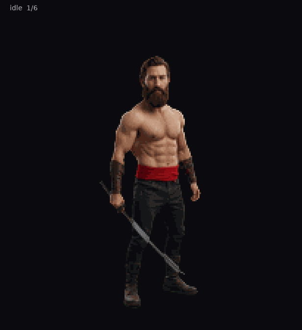
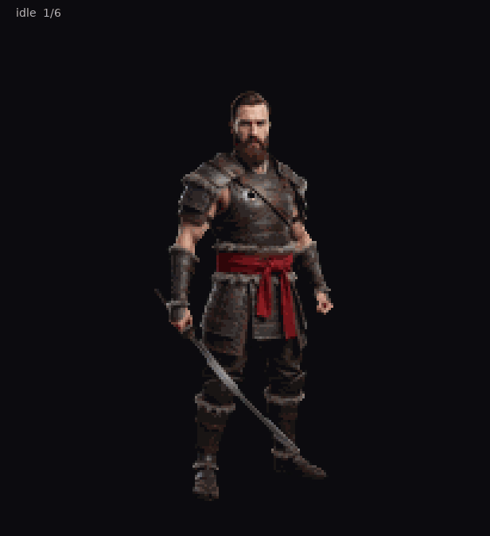

# VikingSamurai

Official **VikingSamurai** animated pets for [Petdex](https://petdex.dev), [Hermes Agent](https://hermes-agent.nousresearch.com/docs/user-guide/features/pets), and Codex.

**One character. Multiple versions. One brand repo.**

| Version | Look | Petdex slug | Folder |
|--------|------|-------------|--------|
| **Classic** | Shirtless warrior + katana | `vikingsamurai` | [`versions/classic`](versions/classic) |
| **Armor** | Layered Viking-samurai armor | `vikingsamurai-armor` | [`versions/armor`](versions/armor) |

<p align="center">
  
  
</p>

Inspired by [VikingSamurai / David Kurzhal](https://fansfollow.me/VikingSamurai) · Gallery profile [petdex.dev/u/ffm](https://petdex.dev/u/ffm)

---

## Quick install

### Hermes

```bash
git clone --depth 1 https://github.com/FansFollow-me/VikingSamurai.git
cp -R VikingSamurai/versions/classic ~/.hermes/pets/vikingsamurai
hermes pets select vikingsamurai
hermes pets scale 0.88

# optional second skin
cp -R VikingSamurai/versions/armor ~/.hermes/pets/vikingsamurai-armor
```

### Petdex / Codex (after brand-slug gallery approval)

```bash
npx petdex install vikingsamurai
npx petdex install vikingsamurai-armor
```

---

## Copy-paste prompts (humans and agents)

### Install Classic

```text
Install the VikingSamurai Classic pet for Hermes from GitHub.
Clone https://github.com/FansFollow-me/VikingSamurai (depth 1),
copy versions/classic to ~/.hermes/pets/vikingsamurai
(must contain pet.json + spritesheet.webp),
run: hermes pets select vikingsamurai && hermes pets scale 0.88 && hermes pets doctor
Do not rename spritesheet.webp. Keep pet.json id as "vikingsamurai".
```

### Install Armor

```text
Install the VikingSamurai Armor pet for Hermes from GitHub.
Clone https://github.com/FansFollow-me/VikingSamurai (depth 1),
copy versions/armor to ~/.hermes/pets/vikingsamurai-armor,
run: hermes pets select vikingsamurai-armor && hermes pets scale 0.88 && hermes pets doctor
pet.json id must stay "vikingsamurai-armor". File inside package stays spritesheet.webp.
```

### Install both

```text
From https://github.com/FansFollow-me/VikingSamurai install both pet versions into Hermes:
- versions/classic to ~/.hermes/pets/vikingsamurai
- versions/armor to ~/.hermes/pets/vikingsamurai-armor
Select classic, scale 0.88, run hermes pets doctor. Report paths and doctor output.
```

### Petdex submit (brand slug)

```text
Submit VikingSamurai pets to Petdex with BRAND slugs (never upload bare spritesheet.webp).
Use folders submit/vikingsamurai/ and submit/vikingsamurai-armor/
each containing only pet.json + spritesheet.webp.
Run: npx petdex login && npx petdex submit ./submit/vikingsamurai && npx petdex submit ./submit/vikingsamurai-armor
Expected gallery URLs: https://petdex.dev/pets/vikingsamurai and https://petdex.dev/pets/vikingsamurai-armor
If old spritesheet-N entries exist, withdraw them first. Petdex cannot rename slugs.
```

More: [`docs/AGENT_PROMPTS.md`](docs/AGENT_PROMPTS.md) · Submit rules: [`docs/PETDEX_SUBMIT.md`](docs/PETDEX_SUBMIT.md)

---

## Layout

```text
VikingSamurai/
├── README.md
├── ABOUT.md
├── LICENSE
├── docs/
│   ├── AGENT_PROMPTS.md
│   └── PETDEX_SUBMIT.md
├── versions/
│   ├── classic/          # shirtless + katana
│   │   ├── pet.json
│   │   ├── spritesheet.webp
│   │   └── preview.gif
│   └── armor/            # armored variant
│       ├── pet.json
│       ├── spritesheet.webp
│       └── preview.gif
└── submit/               # Petdex-ready (folder name = slug)
    ├── vikingsamurai/
    ├── vikingsamurai-armor/
    ├── vikingsamurai.zip
    └── vikingsamurai-armor.zip
```

### Naming

| What | Convention | Example |
|------|------------|---------|
| GitHub repo | PascalCase brand | `FansFollow-me/VikingSamurai` |
| Version folders | lowercase | `versions/classic` |
| Petdex / install slug | kebab-case | `vikingsamurai` |
| `pet.json` `id` | same as slug | `"vikingsamurai"` |
| `displayName` | Brand capitals | `VikingSamurai` |
| Spritesheet file inside package | always | `spritesheet.webp` |
| Submit zip / folder | brand slug | `vikingsamurai.zip` never `spritesheet.zip` |

---

## Atlas (all versions)

1536x1872 · 8x9 · 192x208 · transparent  
Rows: idle, running-right, running-left, waving, jumping, failed, waiting, running, review

---

## Add another version

1. Add `versions/<name>/` with `pet.json` + `spritesheet.webp` (+ `preview.gif`).
2. Set `"id": "vikingsamurai-<name>"` and a clear `displayName`.
3. Mirror to `submit/vikingsamurai-<name>/`.
4. Document in the table above and in `docs/AGENT_PROMPTS.md`.

---

## License

See [LICENSE](LICENSE). FansFollow.me / Hans Al Koch (HAK).
